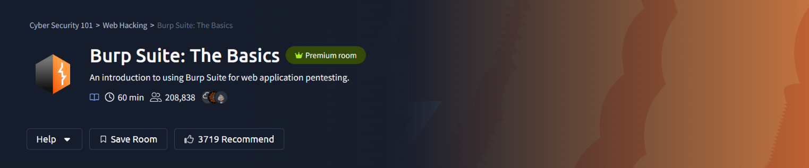
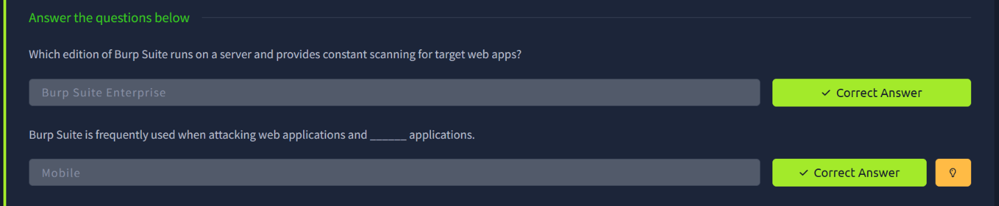
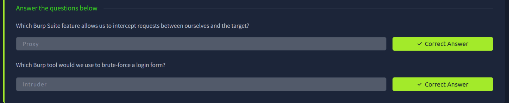
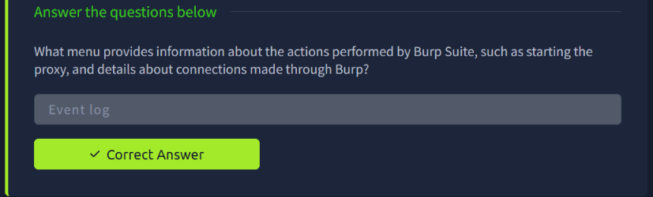
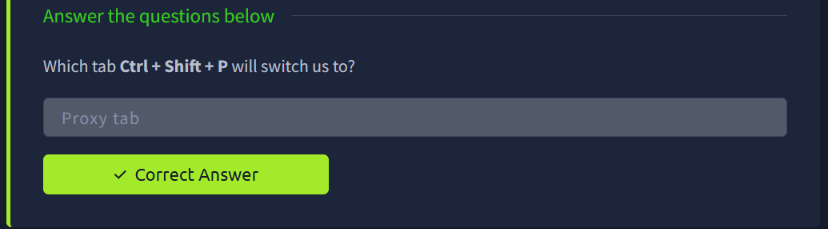
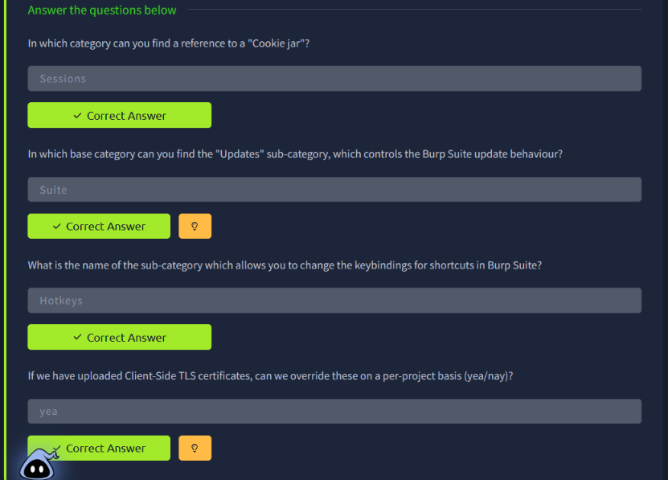
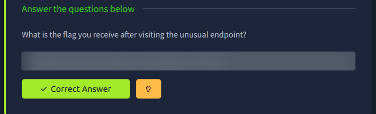

# TryHackMe — Burp Suite: The Basics

> **Track:** Cyber Security 101 → Web Hacking
> **Difficulty:** Easy · **Time:** ~60 min
> **Focus:** Burp Suite editions, core tools (Proxy, Intruder), navigation, settings, and a first hands-on target

Burp Suite is the standard tool for web application testing. It sits between your browser and the target, letting you see, pause, and modify every request that passes through. This room is the orientation: what Burp is, what its tools do, and how to move around it before using it for real.

---

## Table of Contents
1. [Editions and Use Cases](#1-editions-and-use-cases)
2. [Core Tools: Proxy and Intruder](#2-core-tools-proxy-and-intruder)
3. [The Event Log](#3-the-event-log)
4. [Navigation and Shortcuts](#4-navigation-and-shortcuts)
5. [Settings and Configuration](#5-settings-and-configuration)
6. [Hands-On: The Unusual Endpoint](#6-hands-on-the-unusual-endpoint)
7. [Key Takeaways](#7-key-takeaways)

---

## 1. Editions and Use Cases

Burp Suite ships in three editions:

| Edition | Summary |
|---|---|
| **Community** | Free; core manual tools, with some features throttled or missing |
| **Professional** | Adds the automated scanner and unrestricted tooling |
| **Enterprise** | Runs on a server and provides **constant scanning** of target web apps |

Burp isn't limited to browsers. It is frequently used when attacking web applications **and mobile applications**, since a mobile app's traffic can be routed through the proxy in the same way.

---

## 2. Core Tools: Proxy and Intruder

- **Proxy**: the feature that lets you **intercept requests** between yourself and the target. Requests can be held, inspected, edited, and forwarded (or dropped) before the server ever sees them.
- **Intruder**: the tool used to **brute-force a login form**, or more generally to automate sending many variations of a request with different payloads.

**Why it matters:** the Proxy is what turns "browsing a site" into "controlling the conversation with a site". Every other Burp tool builds on requests captured there.

---

## 3. The Event Log

The **Event log** is the menu that records what Burp itself is doing: starting the proxy, and details of connections made through Burp. It's the first place to look when something isn't working, such as a listener that failed to start or traffic that isn't arriving.

---

## 4. Navigation and Shortcuts

Burp is built for speed, and most tabs have hotkeys. **Ctrl + Shift + P** switches to the **Proxy tab**.

---

## 5. Settings and Configuration

Burp's settings are split into **user-level** and **project-level** options, organised into categories:

| Question | Answer |
|---|---|
| Where is the "Cookie jar" referenced? | **Sessions** category |
| Which base category holds the "Updates" sub-category (update behaviour)? | **Suite** |
| Which sub-category changes keybindings for shortcuts? | **Hotkeys** |
| Can uploaded Client-Side TLS certificates be overridden per project? | **Yes** |

Knowing where these live saves time later, for example when you need to tweak session handling or add a client certificate for a target that requires one.

---

## 6. Hands-On: The Unusual Endpoint

The practical task asks you to work with the provided target through Burp and find the **unusual endpoint**, which returns the room's flag when visited. The general approach for this kind of task:

1. Launch Burp and its built-in browser, with traffic routed through the **Proxy**.
2. Browse the target application so Burp records the requests.
3. Review the captured traffic for a path that doesn't fit the rest of the site.
4. Visit that endpoint and read the flag from the response.

> Flag redacted. Follow the steps above yourself to find it.

<!-- TODO (author): add the exact endpoint/path you found and the Burp tab where you spotted it (e.g. Proxy > HTTP history or Target > Site map). The screenshots only captured the answer box, so this step is described generically. -->

---

## 7. Key Takeaways

- **Edition matters**: Community is enough to learn on; Professional adds scanning; Enterprise is built for continuous server-side scanning.
- **Proxy = interception.** It's the foundation for everything else in Burp.
- **Intruder** automates repeated requests, which is the basis for brute-force and fuzzing workflows.
- **Event log first** when troubleshooting Burp itself.
- **Learn the hotkeys and settings layout early**; both speed up real engagements.
- Reviewing captured traffic carefully is how you spot hidden or unusual endpoints that never appear in the site's normal navigation.

---

*Room completed on 28 September 2026 as part of the Cyber Security 101 path.*
